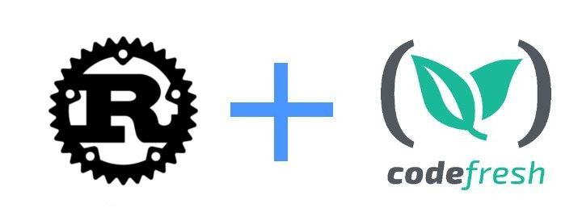

# Codefresh Rust example



This is an example Rust application that uses the Cargo package manager.
It is compiled using Codefresh.


## To build the code

To download dependencies and compile the code:

```bash
cargo build
```

## To run unit tests

```bash
cargo test
```

## To use this project in Codefresh

There is also a [codefresh.yml](codefresh.yml) for easy usage with the [Codefresh](codefresh.io) CI/CD platform.

More details can be found in [Codefresh documentation](https://codefresh.io/docs/docs/learn-by-example/rust/)

